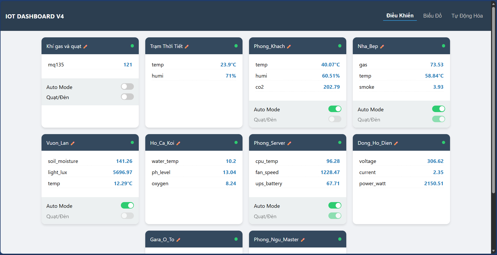
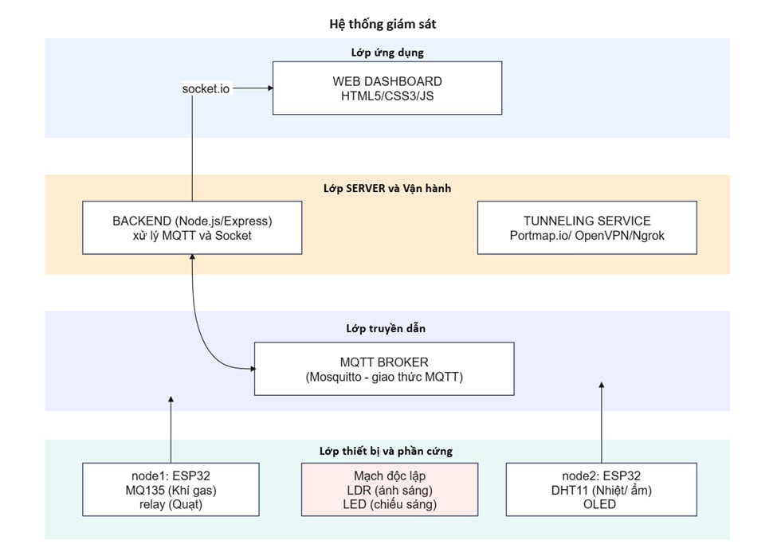
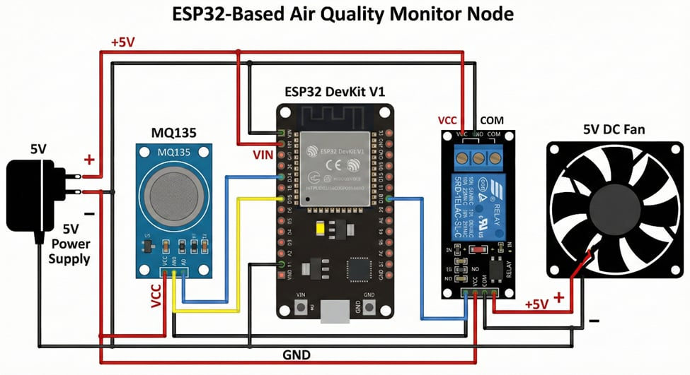

# IoT Smart Home Ultimate - Full Stack Monitoring System


> **Hệ thống giám sát và điều khiển nhà thông minh toàn diện (End-to-End), tối ưu hóa cho độ trễ thấp và trải nghiệm người dùng thời gian thực.**



## 📑 Mục Lục
1. [Giới thiệu](#1-giới-thiệu)
2. [Demo Dự Án](#2-demo-dự-án-video--images)
3. [Kiến Trúc Hệ Thống](#3-kiến-trúc-hệ-thống-system-architecture)
4. [Phân Tích Công Nghệ & Thư Viện](#4-phân-tích-công-nghệ--thư-viện-tech-stack)
5. [Thiết Kế Phần Cứng](#5-thiết-kế-phần-cứng-hardware-design)
6. [Cài Đặt & Triển Khai](#6-cài-đặt--triển-khai)
7. [Tính Năng Nâng Cao](#7-tính-năng-nâng-cao)

---

## 1. Giới thiệu

**IoT Smart Home Ultimate** giải quyết bài toán phân mảnh của các thiết bị IoT bằng cách cung cấp một nền tảng tập trung (Centralized Platform). Hệ thống không chỉ thu thập dữ liệu môi trường mà còn cung cấp khả năng điều khiển phản hồi nhanh (Low Latency Control) và tự động hóa cục bộ (Local Automation).

### Điểm nổi bật:
* **Real-time:** Cập nhật dữ liệu tức thì qua WebSockets (độ trễ < 100ms).
* **Scalable:** Dễ dàng mở rộng thêm hàng chục thiết bị cảm biến mà không cần sửa code Server.
* **Resilient:** Cơ chế tự động kết nối lại (Auto-reconnect) khi mất mạng hoặc mất điện.

---

## 2. Demo Dự Án (Video & Images)

### 🎥 Video Demo Hoạt Động
Xem video demo chi tiết về khả năng phản hồi của hệ thống và tính năng tự động hóa:

[](https://www.youtube.com/watch?v=VIDEO_ID_HERE)


---

## 3. Kiến Trúc Hệ Thống (System Architecture)

Hệ thống hoạt động dựa trên mô hình **Event-Driven Architecture** (Kiến trúc hướng sự kiện).

### Sơ đồ khối (Block Diagram)
Biểu diễn luồng dữ liệu từ Cảm biến -> Vi điều khiển -> Broker -> Server -> Client.



### Luồng xử lý dữ liệu (Data Flow):
1.  **Ingestion:** ESP32 thu thập dữ liệu thô từ cảm biến (Analog/Digital).
2.  **Transport:** Dữ liệu được đóng gói JSON và gửi qua giao thức MQTT (TCP/IP).
3.  **Processing:** Node.js Server phân tích gói tin, lưu vào In-Memory Database (RAM) để truy xuất nhanh.
4.  **Action:** Automation Engine kiểm tra điều kiện. Nếu thỏa mãn, lệnh điều khiển được gửi ngược lại qua MQTT.
5.  **Visualization:** Socket.io đẩy dữ liệu xuống trình duyệt người dùng.

---

## 4. Phân Tích Công Nghệ & Thư Viện (Tech Stack)

Tại sao lại chọn những công nghệ này? Dưới đây là giải thích chi tiết kỹ thuật.

### A. Firmware (ESP32)

| Thư Viện | Tại sao sử dụng? & Cơ chế hoạt động |
| :--- | :--- |
| **`WiFiManager`** | **Vấn đề:** Hard-code SSID/Pass trong code khiến thiết bị không thể dùng ở nơi khác.<br>**Giải pháp:** Thư viện này tạo ra một *Captive Portal*. Khi ESP32 không tìm thấy WiFi cũ, nó tự phát ra WiFi riêng (AP Mode). Người dùng kết nối vào đó để cấu hình WiFi mới qua giao diện web. |
| **`PubSubClient`** | **Vấn đề:** HTTP Request quá chậm và tốn băng thông cho IoT.<br>**Giải pháp:** Sử dụng giao thức MQTT. Thư viện này giúp duy trì kết nối *Persistent Connection* với Broker, giúp việc gửi/nhận tin nhắn diễn ra tức thì với overhead cực thấp (header chỉ 2 bytes). |
| **`ArduinoJson`** | **Vấn đề:** Xử lý chuỗi thủ công (String concatenation) dễ gây lỗi bộ nhớ (Heap Fragmentation).<br>**Giải pháp:** Thư viện này quản lý bộ nhớ động thông minh để Serialization/Deserialization dữ liệu JSON, đảm bảo tính ổn định khi chạy lâu dài. |

### B. Backend (Node.js)

| Thư Viện | Tại sao sử dụng? & Cơ chế hoạt động |
| :--- | :--- |
| **`MQTT.js`** | Đóng vai trò là MQTT Client trên Server. Nó sử dụng cơ chế *Event Emitter* của Node.js để xử lý hàng ngàn tin nhắn đến cùng lúc mà không bị chặn (Non-blocking I/O). |
| **`Socket.io`** | Thay vì để Client phải hỏi Server liên tục (Polling - gây tốn tài nguyên), Socket.io tạo kênh WebSocket giữ kết nối 2 chiều. Server chủ động "bắn" dữ liệu xuống Client ngay khi có tin mới. |
| **`fs-extra`** | Phiên bản nâng cấp của module `fs` gốc. Được dùng để lưu trữ cấu hình (Luật, Tên thiết bị) dưới dạng file JSON (Flat-file Database) - giải pháp đơn giản, không cần cài đặt SQL/NoSQL phức tạp. |

### C. Frontend

| Thư Viện | Tại sao sử dụng? & Cơ chế hoạt động |
| :--- | :--- |
| **`Chart.js`** | Sử dụng HTML5 Canvas để vẽ đồ thị. Nhẹ hơn các thư viện SVG (như D3.js) khi xử lý số lượng điểm dữ liệu lớn trong thời gian thực. |
| **`SortableJS`** | Thư viện JavaScript thuần (không phụ thuộc jQuery) giúp thực hiện thao tác Drag & Drop (Kéo thả) trên DOM, mang lại trải nghiệm UX mượt mà như native app. |

---

## 5. Thiết Kế Phần Cứng (Hardware Design)

### Sơ đồ nguyên lý (Schematic)
Chi tiết cách đấu nối các module với ESP32.




### Bảng đấu nối (Pinout Mapping)

| Module | Pin ESP32 | Loại Tín Hiệu | Ghi chú |
| :--- | :--- | :--- | :--- |
| **DHT11** | GPIO 5 | Digital | Cần trở kéo lên 10k (nếu module chưa có) |
| **Relay** | GPIO 18 | Digital Out | Kích mức High/Low tùy loại module |
| **MQ135** | GPIO 34 | Analog (ADC1) | ESP32 ADC 12-bit (0-4095) |
| **OLED SDA** | GPIO 21 | I2C Data | |
| **OLED SCL** | GPIO 22 | I2C Clock | |

---

## 6. Cài Đặt & Triển Khai

### Yêu cầu tiên quyết
* Node.js v14.0 trở lên.
* Arduino IDE (đã cài board ESP32).
* MQTT Broker (Mosquitto hoặc dùng Aedes tích hợp sẵn trong code).

### Bước 1: Thiết lập Server
```bash

# Di chuyển vào thư mục server
cd server

# Cài đặt dependencies
npm install

# Khởi chạy
node server.js
```
Truy cập: `http://localhost:3000`

### Bước 2: Nạp Firmware
1. Mở `firmware/esp32_main.ino` bằng Arduino IDE.
2. Cài đặt thư viện: `WiFiManager`, `PubSubClient`, `ArduinoJson`, `Adafruit SSD1306`.
3. Chọn board **DOIT ESP32 DEVKIT V1** và nạp code.

### Bước 3: Cấu hình Thiết Bị
1. Sau khi nạp, ESP32 sẽ phát WiFi: **`SETUP_IOT_SYSTEM`**.
2. Kết nối điện thoại vào WiFi này.
3. Trình duyệt tự mở trang cấu hình (Captive Portal).
4. Nhập SSID/Pass WiFi nhà bạn và IP của máy tính chạy Server.

---

## 7. Tính Năng Nâng Cao

* **Auto-Discovery:** Server tự động quét và đăng ký thiết bị mới vào hệ thống Dashboard mà không cần cấu hình thủ công.
* **Dynamic Charting:** Hệ thống tự động phát hiện kiểu dữ liệu (Nhiệt độ, Độ ẩm, Volt...) và tạo biểu đồ tương ứng.
* **Rule Engine:** Logic tự động hóa chạy độc lập trên Server, đảm bảo tính ổn định ngay cả khi mất kết nối Internet (nếu chạy Local LAN).

## 🛡 License
Mã nguồn mở theo giấy phép MIT

---
**Developed by [MKII&NDT]**
